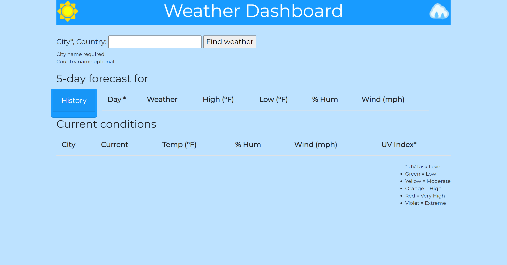
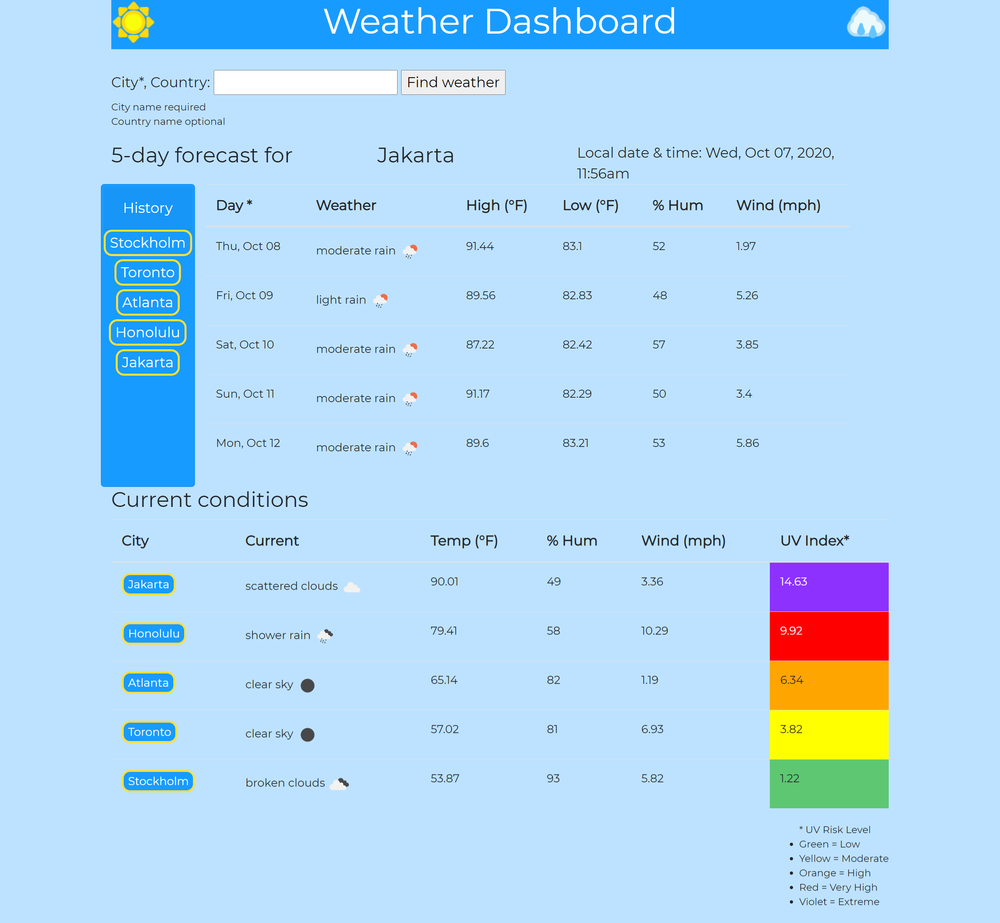

# Weather Dashboard

## Table of Contents

* [Description](#description)
* [Links](#links)
* [Screenshots](#screenshots)
* [Installation Instructions](#installation-instructions)
* [Usage](#usage)
* [Technologies Used](#technologies-used)
* [Tests](#tests)
* [Credits](#credits)
* [Contributing](#contributing)
* [Questions](#questions)
* [Badges](#badges)

## Description

This is a weather dashboard using the third-party API from OpenWeather. The user will search a city using the provided text-box. They will then be presented with the name of the city, current date and time for that city, a five-day forecast, and the current conditions for that city. The name of the city will also appear in a button to the left of the forecast, under "History," which the user can click on to repeat the search of that city. Upon searching for a new city, the forecast and date/time will change to the new city; the newest search will display at the top of the current conditions, with previous searches moving down; and a button with the new city will appear in the "history" section. At any time, the user may revisit the forecast for a previous search by clicking on the name of that city in the "current conditions" portion of the page or the "history" portion pf the page. Upon reloading the page, the user's most recent search will appear in the "forecast" portion of the page and their search history will load as clickable buttons in the "history" portion of the page.

Forecast conditions include date, weather, high and low temperatures in Fahrenheit, relative humidity, and wind speed in mph. Current conditions include current weather, temperature in Fahrenheit, relative humidity, wind in mph, and UV index with risk level indicated by color.

## Links

[Weather Dashboard](https://lauracole1900.github.io/apiWeatherDashboard/)

## Screenshots

Blank dashboard:


Dashboard with cities entered:


User input form:


Clickable buttons to repeat a search:


Dashboard with a search repeated from clicking one of the city buttons:


Dashboard upon reload:


## Installation Instructions

If you want to run a copy of this app on your local machine, first clone the repository:

HTTPS:
```
$ git clone https://github.com/LauraCole1900/apiWeatherDashboard.git
```

SSH:
```
$ git clone git@github.com:LauraCole1900/apiWeatherDashboard.git
```

Then cd into the directory into which you cloned, right-click on index.html, and choose "Open in default browser."

## Usage

This project is intended to be used to allow the user to see forecast and current weather conditions in cities around the globe.

## Technologies Used

[](https://developer.mozilla.org/en-US/docs/Glossary/HTML5) [](https://developer.mozilla.org/en-US/docs/Web/CSS) [](https://jquery.com/) [](https://getbootstrap.com/) [](https://day.js.org/) [](https://openweathermap.org/) [](https://developer.mozilla.org/en-US/docs/Web/API/Window/localStorage)
## Tests

npm run test

## Credits

Weather icons in the header created by Joey Yakimowich-Payne, licensed under Creative Commons (http://creativecommons.org/licenses/by/3.0/)

OpenWeather's products and services licensed under Creative Commons Attribution-ShareAlike 4.0 International licence (https://creativecommons.org/licenses/by-sa/4.0/), and the data and database are licensed under the Open Data Commons Open Database License (https://opendatacommons.org/licenses/odbl/).

Bootstrap, jQuery, and Dayjs are licensed under MIT.

## Contributing

N/A

## Questions

If you have further questions, you can reach me at lauracole1900@comcast.net. For more of my work, see [my GitHub](https://github.com/LauraCole1900).

## Badges

 [](https://open.vscode.dev/LauraCole1900/apiWeatherDashboard)